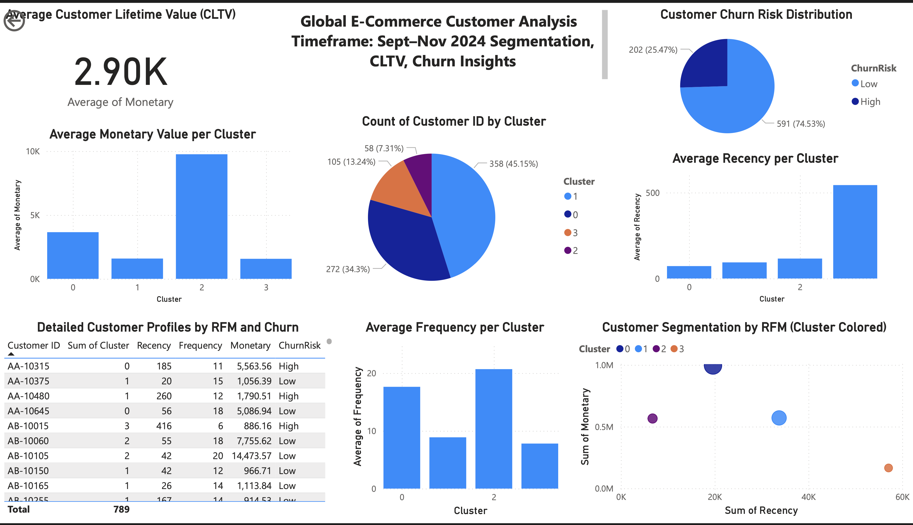
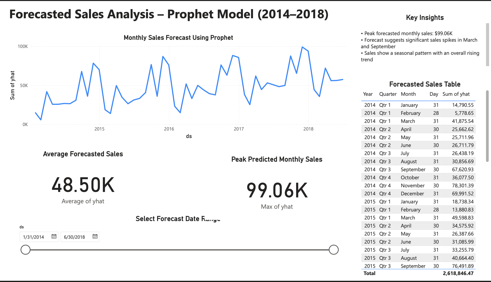

# 📊 Global E-Commerce Sales Analysis

A complete data analysis and visualization project built using **Python** and **Power BI Web** to uncover actionable insights from global e-commerce sales data. This project includes customer segmentation, sales forecasting, and product performance evaluation using real-world business intelligence techniques.

---

## 📌 Project Highlights

- 🔹 Built 3 professional dashboards using **Power BI Web (Mac-compatible)**
- 🔹 Implemented **Prophet** for time series forecasting of monthly sales
- 🔹 Performed **customer segmentation** using RFM + K-Means clustering
- 🔹 Identified top-performing products from total sales volume
- 🔹 Designed fully interactive dashboards with KPI cards, slicers, and tables

---

## 📁 Repository Structure

```bash
E-Commerce-Sales-Analysis/
├── README.md
├── ecommerce_analysis.ipynb
├── data/
│   ├── rfm_clusters_with_churn.csv
│   ├── forecast.csv
│   └── product_sales.csv
├── dashboards/
│   ├── rfm_dashboard.pdf
│   ├── forecast_dashboard.pdf
│   └── product_sales_dashboard.pdf
├── images/
│   ├── rfm_dashboard.png
│   ├── forecast_chart.png
│   └── top10_products.png
```

## 🔍 Dashboard Summaries

### 🧠 1. Customer Segmentation Dashboard
- Engineered RFM (Recency, Frequency, Monetary) features  
- Applied K-Means clustering to group customer behavior  
- Added churn risk flag (`Recency > 180 → High`)  
- **Visuals:** CLTV card, churn pie chart, scatter plot, bar charts, data table  

---

### 📈 2. Sales Forecasting Dashboard
- Aggregated monthly sales data  
- Applied Prophet model to forecast 6-month trends  
- **Visuals:** Forecast line chart, KPI cards (peak/avg), slicer, forecast table  

---

### 💰 3. Product Performance Dashboard
- Ranked top-selling products and calculated total revenue  
- **Visuals:** Top 10 product bar chart, sales total card, full product table  
- **Insights:** Most revenue came from top 10 SKUs

## 🖼 Dashboard Snapshots

Preview of the dashboards built in Power BI Web:





## 👨‍💻 Author

**Laxmi Lahari Naidu**  
M.S. in Computer Science, Binghamton University  
📫 [GitHub](https://github.com/laharibugata)  
🔗 [LinkedIn](https://www.linkedin.com/in/your-profile)

